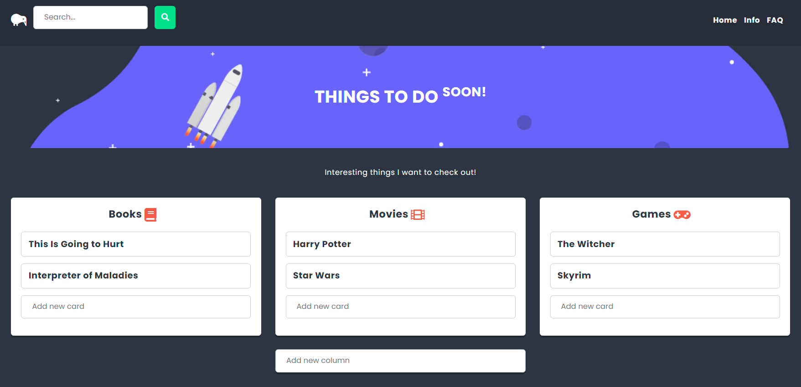

<p align="center">
</a>
</p>
<br>
  
# TO-DO APP React

A to-do app that has several lists. When you select a list, you are shown sorted columns that contain cards. The search field allows you to search the to-do cards and shows them on a separate page. It is possible to add more columns and cards.

[:sparkles: Published version](https://marcela-os.github.io/React-starter/)

## Tech Stack

* HTML
* CSS
* SCSS
* JavaScript JSX
* React
* Redux
* Router
* Webpack

  
## Lessons

* how to create simple app using React
* check value types in props
* work with state component
* debug React - using React Developer Tools
* create store, actions and reducers with Redux
* debug Redux - using Redux DevTools
* use React Router (Link, NavLink, Switch, AnimatedSwitch etc.),
* use and configure a webpack
* configure ESLint and force code validation with ESLint


## Room for Improvement

* develop functionality for cards (possibility to delete, swap places, move to other columns)
* adding new columns under previous ones not next to

  
## Run Locally

Install dependencies

```bash
  npm install
```

Start the server

```bash
  npm run start
```

  
## Authors

:woman: [@marcelaos](https://github.com/marcela-os)

  